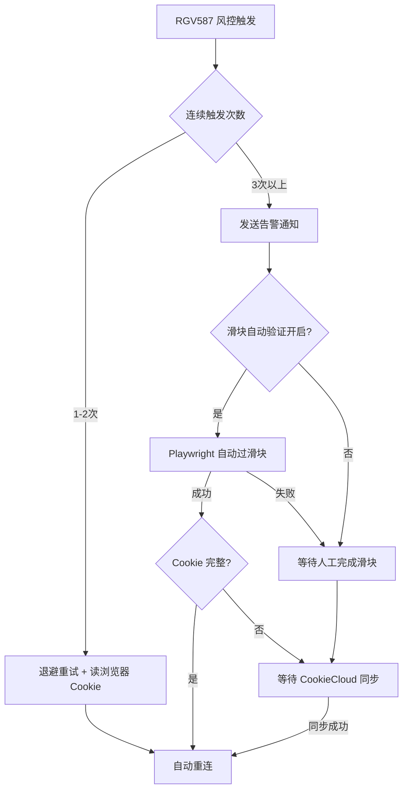

<div align="center">

# 🦞 Xianyu OpenClaw

**闲鱼卖家自动化工作台：消息、报价、订单、虚拟商品、闲管家与运维面板一体化**

[](https://github.com/G3niusYukki/xianyu-openclaw/actions)
[](https://www.python.org/downloads/)
[](https://nodejs.org/)
[](LICENSE)

[快速开始](#-快速开始) · [部署文档](docs/DEPLOYMENT.md) · [用户指南](USER_GUIDE.md) · [更新日志](CHANGELOG.md)

</div>

---

## 项目现状

当前仓库已经演进为一个 **多运行时、模块化、可视化** 的闲鱼自动化工作台，核心能力包括：

- **消息自动化**：WebSocket / DOM / auto 三种传输模式，自动回复、双层去重、议价识别、人工接管、会话工作流
- **自动报价**：成本表导入、地理归一化、远程报价源回退、缓存与熔断
- **订单履约**：订单状态同步、售后模板、实物物流发货、闲管家开放平台对接
- **虚拟商品闭环**：回调接入、事件去重、调度执行、重放与人工兜底
- **运营模块**：自动调价、擦亮、数据统计、增长实验与合规中心
- **Dashboard**：配置中心、模块状态、Cookie 健康、闲管家控制面板、订单回调入口、手动重试操作
- **多平台部署**：本地一键启动、Docker Compose、Windows EXE / bat 脚本、macOS launchd 守护

> 如果你之前看过旧版文档：项目已不再只是“v2.0 的虚拟商品自动化平台”，当前主线已经覆盖 **7.x 系列能力**，并且正在进入以订单闭环和控制台完善为主的阶段。

---

## 🎉 v3.0 重大更新

### 核心新功能

| 功能 | 描述 | 版本 |
|------|------|------|
| 🛡️ **风控滑块自动验证** | RGV587 触发后自动检测 NC/拼图滑块并模拟拖拽，Playwright + OpenCV | v3.0 |
| 🔄 **CookieCloud 集成** | 浏览器扩展即时同步 Cookie，风控恢复秒级生效，免手动复制 | v3.0 |
| 🎯 **自动回复引擎增强** | 30+ 意图规则、售后自动转人工、复购引导、系统通知过滤 | v3.0 |
| 💰 **多店铺首单优惠修正** | 报价模板"首单价格"改"参考价格"，跨店场景正确引导 | v3.0 |
| 🖼️ **商品图片模板重构** | 7 个新视觉模板 + 统一渲染引擎，支持自定义字体/配色 | v3.0 |
| 🖥️ **macOS LaunchAgent** | 一键安装后台守护服务，开机自启动 | v3.0 |
| 📝 **前端 TypeScript 迁移** | 全部页面组件迁移至 TypeScript，类型安全 | v3.0 |

### 风控自动恢复架构



---

## 🎉 v2.0 重大更新

### 1) 售前消息自动化

- 自动识别咨询、议价、下单意图
- 支持标准格式回复与非空回复兜底
- 双层去重：精确 hash + 内容 hash
- 支持会话上下文记忆、人工接管与恢复
- 支持 workflow worker、SLA 基准测试与首响指标

### 2) 自动报价

- 本地 Excel / CSV 成本表导入
- 省市名称归一化与模糊匹配
- API 成本源 + 本地规则双路径
- TTL 缓存、stale-while-revalidate、熔断降级
- CLI 可直接做 health / candidates / setup

### 3) 订单与闲管家集成

- 闲管家开放平台签名与 API 适配层
- 实物订单可走 API 改价 / API 发货
- 支持 Dashboard 中保存 AppKey / AppSecret
- 支持支付后回调：`/api/orders/callback`
- 发货失败时可降级为人工发货任务，避免假阳性完成态

### 4) 虚拟商品闭环

- 回调入站与事件去重
- 调度器批处理、事件重放、人工接管
- 适合卡密、兑换码、虚拟交付类场景

### 5) 运维与治理

- Cookie 健康检查与浏览器侧续期
- 合规策略中心、审计与重放
- AI 调用成本统计
- 增长实验与漏斗分析
- 模块化启动：`presales / operations / aftersales`

---

## 🏗️ 当前架构

```text
React/Vite 前端 (client)
  └─ 管理面板 / 配置中心 / 状态页 / 运营页面

Node.js 后端 (server)
  └─ 轻量 API 层 / 配置接口 / 前端联动

Python 核心后端 (src)
  ├─ Dashboard HTTP 服务
  ├─ Messages / Quote / Orders / Virtual Goods / Operations
  ├─ Xianguanjia integration
  ├─ Cookie / Compliance / Growth / Analytics
  └─ CLI + 模块化守护进程
```

### 关键目录

```text
xianyu-openclaw/
├── client/                     # React + Vite 前端
├── server/                     # Node.js API 层
├── src/                        # Python 核心后端
│   ├── cli.py                  # 统一 CLI 入口
│   ├── dashboard_server.py     # Dashboard HTTP 服务
│   ├── integrations/xianguanjia/
│   └── modules/
│       ├── messages/
│       ├── quote/
│       ├── orders/
│       ├── virtual_goods/
│       ├── operations/
│       ├── growth/
│       └── compliance/
├── config/                     # 配置样例
├── docs/                       # 部署与补充文档
├── scripts/                    # macOS / Unix / Windows 辅助脚本
└── tests/                      # 回归与覆盖测试
```

---

## 🚀 快速开始

### 环境要求

- Python 3.10+
- Node.js 18+
- npm
- Chrome / Edge（Cookie 自动获取、Playwright 浏览器能力相关）
- 闲鱼 Cookie
- AI API Key（如需自动回复 / 内容生成）

### 方式一：本地一键启动

```bash
git clone https://github.com/G3niusYukki/xianyu-openclaw.git
cd xianyu-openclaw
cp .env.example .env

# macOS / Linux
./start.sh

# Windows
start.bat
```

启动脚本会自动：

1. 创建 Python 虚拟环境
2. 安装 Python / Node.js 依赖
3. 安装 Playwright Chromium
4. 启动：
   - React 前端：`http://localhost:5173`
   - Node 后端：`http://localhost:3001`
   - Python Dashboard：`http://localhost:8091`

### 方式二：手动启动

```bash
python3 -m venv .venv && source .venv/bin/activate
pip install -r requirements.txt
playwright install chromium

cd server && npm install && cd ..
cd client && npm install && cd ..

cp .env.example .env

python -m src.dashboard_server --port 8091
npm run dev:server
npm run dev:client
```

### 方式三：Docker Compose

```bash
cp .env.example .env
docker compose up -d
```

详细部署见：[docs/DEPLOYMENT.md](docs/DEPLOYMENT.md)

---

## ⚙️ 最小配置

`.env` 里至少建议配置：

```bash
XIANYU_COOKIE_1=your_cookie_here

AI_PROVIDER=deepseek
AI_API_KEY=your_api_key
AI_BASE_URL=https://api.deepseek.com/v1
AI_MODEL=deepseek-chat

XGJ_APP_KEY=
XGJ_APP_SECRET=
XGJ_BASE_URL=https://open.goofish.pro
```

### CookieCloud 配置（可选，推荐）

CookieCloud 是浏览器扩展，可将 Cookie 实时同步到服务端，风控恢复时秒级生效：

```bash
# 环境变量方式
COOKIE_CLOUD_UUID=your-uuid        # CookieCloud 用户 ID
COOKIE_CLOUD_PASSWORD=your-password  # CookieCloud 加密密码
```

也可在前端「系统设置 → 集成服务 → CookieCloud 配置」中填写。

### 风控滑块自动验证配置（可选）

在前端「系统设置 → 集成服务 → 风控滑块自动验证」中开启：

| 参数 | 说明 | 默认值 |
|------|------|--------|
| `enabled` | 是否启用自动过滑块 | `false` |
| `max_attempts` | 单次风控最大尝试次数 | `3` |
| `cooldown_seconds` | 两次尝试间冷却时间 | `60` |
| `headless` | 是否无头模式运行浏览器 | `false` |

> **风险提示**：自动过滑块存在账号封控风险，建议配合 CookieCloud 使用，优先通过手动验证恢复。

### 系统配置页面

可视化配置（v2.0 起）：
- **AI 设置** - 6家提供商引导卡片，一键切换
- **Cookie 设置** - 粘贴验证、实时评级、获取指南
- **告警通知** - Webhook 配置、事件开关、测试发送
- **闲管家 API** - AppKey / Secret 管理
- **CookieCloud** - 同步配置、手动同步按钮（v3.0）
- **风控滑块自动验证** - 开关/参数/风险提示（v3.0）

---

## 🧭 常用 CLI

### 实时健康面板

Dashboard 集成 5 大服务状态：
- 🟢 Node 后端
- 🟢 Python 后端  
- 🟢 Cookie 健康
- 🟢 AI 服务
- 🟢 闲管家 API

### 告警场景

| 场景 | 级别 | 通知渠道 |
|------|------|----------|
| Cookie 过期 | P0 | 飞书 + 企业微信 |
| RGV587 风控滑块触发 | P0 | 飞书 + 企业微信 |
| Cookie 自动刷新成功 | P1 | 飞书 |
| 滑块自动验证成功/失败 | P1 | 飞书 |
| 售后介入 | P1 | 飞书 |
| 发货失败 | P1 | 飞书 |
| 人工接管 | P2 | 飞书 |

---

## 🗂️ 项目结构

```
xianyu-openclaw/
├── src/                          # Python 后端
│   ├── main.py                   # 主入口
│   ├── cli.py                    # CLI 工具
│   ├── dashboard_server.py       # Dashboard API
│   ├── core/                     # 核心模块
│   │   ├── cookie_health.py      # Cookie 健康检查
│   │   ├── cookie_grabber.py     # Cookie 自动刷新
│   │   ├── slider_solver.py      # 风控滑块自动验证（NC/拼图）
│   │   ├── notify.py             # 通知模块
│   │   └── playwright_client.py  # 浏览器自动化
│   ├── dashboard/                # Dashboard 服务层
│   │   ├── config_service.py     # 配置管理服务
│   │   ├── repository.py         # 数据仓库
│   │   └── router.py             # 路由注册
│   └── modules/                  # 业务模块
│       ├── messages/             # 消息（去重、议价、回复）
│       │   ├── service.py        # 消息服务
│       │   ├── reply_engine.py   # 意图规则引擎（30+ 规则）
│       │   ├── workflow.py       # 会话状态机
│       │   └── ws_live.py        # WebSocket 消息监听
│       ├── listing/              # 商品（上架、模板、OSS）
│       │   ├── service.py        # 商品服务
│       │   ├── auto_publish.py   # 自动发布
│       │   └── image_generator.py # 图片生成
│       ├── orders/               # 订单（同步、发货）
│       │   ├── service.py        # 订单服务
│       │   └── xianguanjia.py    # 闲管家集成
│       ├── virtual_goods/        # 虚拟商品（卡密）
│       ├── quote/                # 报价引擎
│       │   ├── engine.py         # 报价核心
│       │   └── providers.py      # 报价数据源
│       ├── analytics/            # 数据分析
│       └── accounts/             # 账号管理
├── server/                       # Node.js 后端
│   └── src/
│       ├── routes/
│       │   ├── xianguanjia.js    # 闲管家代理
│       │   └── config.js         # 配置管理
├── client/                       # React 前端（TypeScript）
│   └── src/
│       ├── pages/                # 页面
│       │   ├── config/           # 系统配置（含CookieCloud/滑块）
│       │   ├── accounts/         # 店铺管理
│       │   ├── products/         # 商品管理
│       │   └── analytics/        # 数据分析
│       └── components/           # 组件
│           ├── ApiStatusPanel.tsx # 状态面板
│           └── SetupGuide.tsx    # 引导组件
├── tests/                        # 测试
├── config/                       # 配置模板
│   ├── config.example.yaml       # 主配置示例
│   ├── categories/               # 品类配置
│   └── templates/                # 回复模板
├── docs/                         # 文档
├── database/                     # 数据库迁移
├── docker-compose.yml            # Docker 编排
├── scripts/                      # 脚本工具
│   ├── install-launchd.sh        # macOS LaunchAgent 安装
│   └── uninstall-launchd.sh      # macOS LaunchAgent 卸载
├── start.sh                      # 一键启动（macOS/Linux）
└── start.bat                     # 一键启动（Windows）
```

---

## 🛠️ 开发指南

```bash
# 系统体检
python -m src.cli doctor --strict

# 售前 / 运营 / 售后模块检查
python -m src.cli module --action check --target all
python -m src.cli module --action status --target all

# 启动售前 worker
python -m src.cli module --action start --target presales --mode daemon --background

# 消息自动回复 / SLA 基准
python -m src.cli messages --action auto-reply --limit 20 --dry-run
python -m src.cli messages --action sla-benchmark --benchmark-count 120

# 报价健康检查
python -m src.cli quote --action health

# 订单履约 / 发货
python -m src.cli orders --action trace --order-id ORDER_ID
python -m src.cli orders --action deliver --order-id ORDER_ID --waybill-no SF123

# 虚拟商品回调调度
python -m src.cli virtual-goods --action scheduler --dry-run
```

---

## 🖥️ Dashboard 当前重点能力

Dashboard 不只是“看板”，现在也是主要的运维入口之一：

- Cookie 配置与健康状态
- AI 服务配置
- 闲管家配置区（AppKey / AppSecret / 自动改价 / 自动发货 / 支付后自动触发）
- 订单回调入口显示：`/api/orders/callback`
- API 改价 / API 发货手动重试
- 模块状态与恢复入口

健康检查接口：

- Python Dashboard：`GET /healthz`
- Node.js 后端：`GET /health`

---

## 🧪 测试与质量

```bash
pytest tests/
ruff check src tests
ruff format src tests

# 前端构建
cd client && npm run build
```

---

## ❓ 常见问题

### Cookie 自动获取失败 / 无法打开浏览器窗口

**症状**：Dashboard 点击"自动获取 Cookie"显示"无法启动浏览器"或"所有获取方式均失败"。

**解决**：
1. 确认已安装 Playwright 浏览器：`playwright install chromium`
2. 确认本机已安装 Chrome 或 Edge 浏览器
3. 如需静默自动刷新（Level 1），需在本机 Chrome/Edge 中至少登录一次闲鱼

### Cookie 频繁失效 / WebSocket 断连

**症状**：消息监听中断，日志出现 `FAIL_SYS_USER_VALIDATE`。

**解决**：
1. 保持本机 Chrome/Edge 浏览器开启且闲鱼已登录，系统会自动从浏览器读取最新 Cookie
2. 确认 `COOKIE_AUTO_REFRESH=true` 已在 `.env` 中设置
3. 如无法保持浏览器登录，可在 Dashboard 手动粘贴 Cookie

### RGV587 风控滑块触发怎么办

**症状**：日志出现 `RGV587`，WebSocket 断连，告警通知"闲鱼触发风控验证"。

**解决**：
1. **推荐方案** — 安装 [CookieCloud](https://github.com/nichenqin/CookieCloud) 浏览器扩展：
   - Chrome/Edge 安装 CookieCloud 扩展
   - 在扩展中设置 UUID 和密码
   - 在前端「系统设置 → 集成服务 → CookieCloud 配置」中填入相同的 UUID 和密码
   - 在浏览器中手动通过闲鱼滑块验证后，CookieCloud 自动同步最新 Cookie
2. **自动方案** — 在前端「系统设置 → 集成服务 → 风控滑块自动验证」中开启自动过滑块（有封号风险，谨慎使用）
3. **手动方案** — 在 Dashboard「账户管理」页面粘贴新 Cookie

### CookieCloud 配置步骤

1. 安装 [CookieCloud](https://github.com/nichenqin/CookieCloud) 浏览器扩展
2. 扩展设置中：
   - 选择"自托管"或使用公共服务
   - 记录 UUID 和加密密码
3. 在前端「系统设置 → 集成服务 → CookieCloud 配置」中填入 UUID 和密码，保存
4. 当 Cookie 失效时，在浏览器登录闲鱼后点击 CookieCloud 扩展的"同步"，系统自动获取最新 Cookie

### Windows 上 Playwright 安装失败

**症状**：`playwright install chromium` 报错或超时。

**解决**：
1. 确认网络可以访问 `cdn.playwright.dev`
2. 如网络受限，可设置代理：`set HTTPS_PROXY=http://proxy:port` 后重试
3. 使用一键启动脚本 `start.bat` 会自动处理安装

---

## 📦 发布说明

### v3.0.0 (2026-03-08)

**新增功能**
- 🛡️ 风控滑块自动验证 — NC/拼图滑块自动解决（Playwright + OpenCV，三级浏览器策略）
- 🔄 CookieCloud 集成 — 浏览器扩展即时同步 Cookie，风控恢复秒级生效
- 🎯 自动回复意图引擎增强 — 30+ 规则，售后自动转人工，复购引导，系统通知过滤
- 💰 多店铺首单优惠修正 — 报价模板统一使用"参考价格"，避免跨店误导
- 🖼️ 商品图片模板重构 — 7 个新视觉模板 + 统一渲染引擎
- 🖥️ macOS LaunchAgent — 一键安装后台守护服务
- 📝 前端 TypeScript 迁移 — 全部页面和组件迁移至 TypeScript

**架构优化**
- 前端 UI 滑块配置区，含风险提示和参数调节
- 告警通知文案根据 CookieCloud / 滑块配置状态动态生成
- 会话状态机（WorkflowState）防止已下单后重复催单
- 意图规则引擎支持 `skip_reply`（系统通知静默跳过）

**部署改进**
- `requirements.txt` — `opencv-python` 改为 `opencv-python-headless`（Docker 兼容）
- `config.example.yaml` — 新增 `slider_auto_solve` 配置段
- `scripts/install-launchd.sh` — macOS 后台服务一键安装

### v2.0.0 (2026-03-07)

- Dashboard 闲管家控制面板补齐
- ` /api/orders/callback ` 订单支付后触发链路补齐
- 实物订单在未真正提交物流单时保持 `processing`
- 文档统一到当前仓库结构、脚本、模块和端点

如需查看历史变更，请阅读 [CHANGELOG.md](CHANGELOG.md)。

---

## 🤝 贡献

欢迎提 Issue / PR。

```bash
git checkout -b feature/your-change
# 修改后运行测试
git commit -m "docs: update project documentation"
git push origin feature/your-change
```

---

## ⚠️ 免责声明

本项目仅供学习、研究和合法合规的业务自动化实践使用。请遵守闲鱼平台规则及所在地法律法规，Cookie、API Key 与回调数据需妥善保管。

---

## 📄 License

MIT
