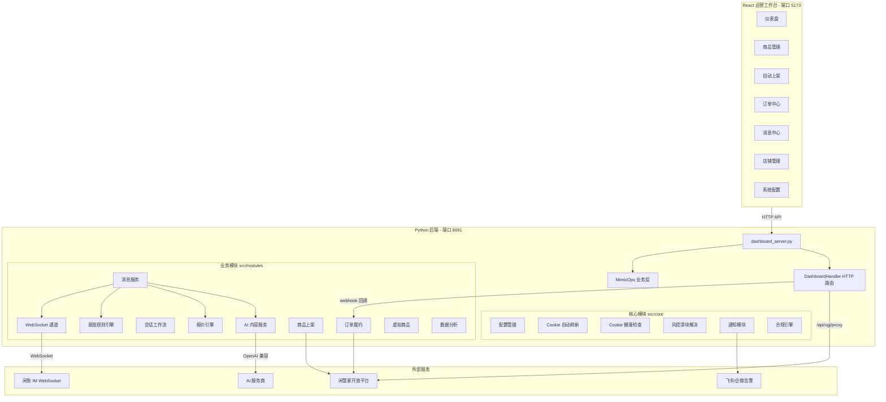
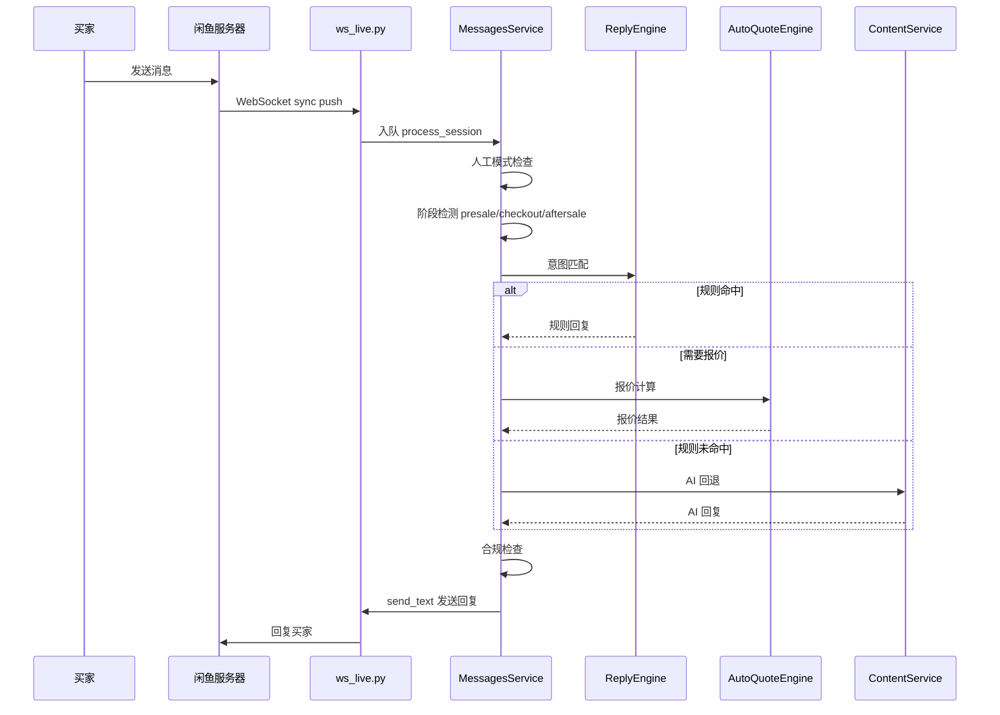
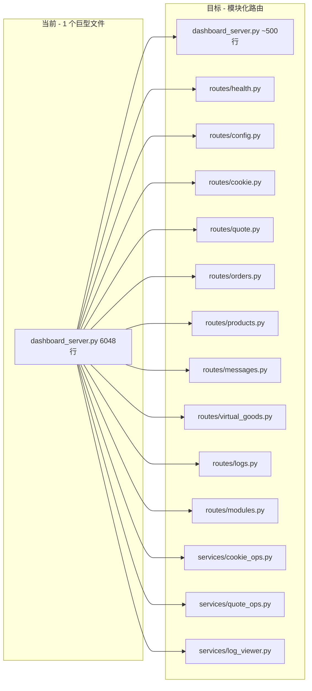

# 闲鱼管家项目概述与优化计划

> 生成时间：2026-03-14
> 基于工作树 `heuristic-swartz` 和主仓库 `main` 的深入分析

---

## 一、项目概述

### 1.1 项目定位

**闲鱼管家（Xianyu OpenClaw）** 是为闲鱼虚拟商品卖家设计的 **API-first 全自动化运营工作台**。核心场景是**快递代发**：买家询价 → 机器人自动报价 → 买家下单 → 卖家改价 → 付款后自动发兑换码 → 买家到小程序下单寄件。

### 1.2 技术栈

| 层级 | 技术 | 说明 |
|------|------|------|
| **前端** | React 18 / Vite / TailwindCSS / TypeScript | 运营工作台，7 个页面 |
| **Python 后端** | Python 3.10+ / asyncio / SQLite | 唯一核心引擎，端口 8091 |
| **AI 服务** | OpenAI 兼容 API | 支持 6 家国产大模型 |
| **消息通道** | WebSocket 直连闲鱼 IM | DingTalk WS 协议 |
| **外部集成** | 闲管家开放平台 API | 商品/订单/发货/webhook 回调 |

> **注意**：Node.js 后端已完全移除（`server/` 目录仅保留 CookieCloud 数据文件），所有 webhook 验签和 API 代理功能已下沉到 Python 端。

### 1.3 版本演进

```
v1.0 (02-21) → 基础模块骨架
v2.0 (02-22) → Streamlit + React + FastAPI
v3.0 (02-23) → Playwright 自动化 + Docker
v4.0 (02-23) → OpenClaw Gateway + CLI
v4.2 (02-27) → 消息自动回复 + Dashboard
v4.3 (02-27) → 自动报价引擎
v4.4 (02-27) → 会话工作流状态机
v4.6 (02-27) → 国产大模型 + 合规中心 + Growth
v4.8 (02-28) → WebSocket 实时传输
v5.0 (02-28) → 售前运行时强化
v5.2 (03-01) → Cookie 健康监控
v5.3 (03-02) → Lite 直连运行时 + 报价增强
v6.0 (03-02) → 闲管家开放平台适配
v6.1 (03-03) → Windows EXE 部署工具
当前  (03-07) → API-first 主线收口（PR #42）
```

### 1.4 架构全景



### 1.5 数据流



---

## 二、模块清单与代码规模

### 2.1 Python 后端核心文件

| 文件 | 行数 | 职责 | 健康度 |
|------|------|------|--------|
| `src/dashboard_server.py` | **6048** | HTTP 服务 + MimicOps 业务层 + 路由分发 | 🔴 巨型文件 |
| `src/modules/messages/service.py` | **2052** | 消息处理、报价模板、会话阶段、AI 调用 | 🟡 职责偏重 |
| `src/modules/messages/ws_live.py` | **1488** | WebSocket 通道 + MessagePack 解码 | 🟡 可拆分 |
| `src/modules/virtual_goods/service.py` | **1193** | 虚拟商品全生命周期 | 🟢 合理 |
| `src/modules/messages/reply_engine.py` | **1133** | 意图规则引擎 + 30+ 规则定义 | 🟢 合理 |
| `src/modules/messages/workflow.py` | **1014** | 会话状态机 + Worker + SLA | 🟢 合理 |
| `src/modules/orders/service.py` | **915** | 订单履约闭环 | 🟢 合理 |
| `src/dashboard/config_service.py` | **869** | 配置 CRUD + 内嵌省市区数据 | 🟡 数据应分离 |
| `src/modules/content/service.py` | **569** | AI 内容生成 | 🟢 合理 |
| `src/modules/listing/auto_publish.py` | **471** | 自动上架编排 | 🟢 合理 |
| `src/cli.py` | **~1400** | CLI 工具 | 🟢 合理 |

### 2.2 前端页面

| 页面 | 文件 | 行数 | 功能 |
|------|------|------|------|
| 消息中心 | `Messages.tsx` | 511 | 回复日志 + 对话沙盒 + 人工模式 |
| 仪表盘 | `Dashboard.tsx` | 466 | 总览 + 趋势图 + 快捷入口 |
| 订单中心 | `Orders.tsx` | ~400 | 订单列表 + 状态管理 |
| 系统配置 | `SystemConfig.tsx` | ~600 | 多 Tab 配置面板 |
| 商品管理 | `ProductList.tsx` | ~400 | 商品列表 + 上下架 |
| 自动上架 | `AutoPublish.tsx` | ~500 | 发布队列 + 模板选择 |
| 店铺管理 | `AccountList.tsx` | ~300 | Cookie 管理 |

### 2.3 已拆分的 Dashboard 子模块（工作树独有）

| 文件 | 行数 | 职责 |
|------|------|------|
| `src/dashboard/config_service.py` | 869 | 配置 CRUD + 省市区数据 |
| `src/dashboard/repository.py` | ~370 | 数据仓库 + 闲管家数据源 |
| `src/dashboard/module_console.py` | ~130 | 模块控制 CLI 封装 |
| `src/dashboard/router.py` | 67 | 路由装饰器框架（**未被使用**） |

### 2.4 测试覆盖

- 测试文件数：**80+**
- 最近发布检查：891 passed，覆盖率 89.04%
- `pytest.ini` 配置 `--cov-fail-under=80`

---

## 三、工作树 vs 主仓库差异

| 维度 | 工作树 heuristic-swartz | 主仓库 main |
|------|------------------------|-------------|
| `dashboard_server.py` | 6048 行（已拆分部分逻辑） | 6806 行（未拆分） |
| `src/dashboard/` | ✅ 5 个子模块 | ❌ 空目录 |
| `src/lite/` | ❌ 不存在 | ✅ 9 个文件（Lite 直连运行时） |
| `skills/` | ❌ 不存在 | ✅ 5 个 Claude Skills |
| `CHANGELOG.md` | ❌ 不存在 | ✅ 完整版本历史 |
| `IMPROVEMENTS.md` | ❌ 不存在 | ✅ 4 阶段优化报告 |
| `pyproject.toml` | ❌ 不存在 | ✅ 项目配置 |
| `ruff.toml` | ❌ 不存在 | ✅ Lint 配置 |

---

## 四、已完成的优化（来自 IMPROVEMENTS.md + CHANGELOG.md）

### ✅ 阶段 1 — 紧急修复
- 修复 19 处裸 except 语句
- 修复 asyncio.run 误用
- 实现敏感信息脱敏

### ✅ 阶段 2 — 短期改进
- Pydantic 配置验证（9 个模型类）
- 并发安全（asyncio.Lock）
- SQL 注入防护（白名单）
- AI 调用超时控制

### ✅ 阶段 3 — 中期优化
- 依赖版本管理（requirements.lock）
- 抽象接口层（9 个 I*Service 接口）
- 依赖注入容器（ServiceContainer）
- 统一错误处理（@retry / @handle_errors）

### ✅ 阶段 4 — 长期改进
- 测试覆盖（pytest.ini + conftest + 多个测试文件）
- 性能优化（AsyncCache / FileCache / PerformanceMonitor）
- 代码质量工具（Ruff / Black / isort / Mypy）

### ✅ 业务功能
- WebSocket 直连闲鱼 IM
- 30+ 意图规则引擎
- 多源报价引擎（规则表/成本表/API/远程）
- 会话工作流状态机 + SLA 监控
- 闲管家开放平台集成（商品/订单/发货）
- Cookie 自动刷新 + 健康监控
- 风控滑块自动验证
- 飞书/企微多渠道告警
- 自动上架（AI 生成 + 模板 + OSS + API 发布）
- 虚拟商品全生命周期
- 合规策略中心
- A/B 分流 Growth 服务

---

## 五、当前仍存在的问题

### 🔴 P0 — 架构级技术债务

**5.1 `dashboard_server.py` 巨型文件（6048 行）**

这是项目最大的技术债务。虽然已拆分出 `config_service.py`、`repository.py`、`module_console.py`，但核心问题未解决：

- `MimicOps` 类仍有 **90+ 个方法**，混合了 Cookie 管理、报价规则解析、日志查看、虚拟商品面板、风控检测、服务控制等完全不同的领域
- `DashboardHandler.do_GET` 约 **800 行** if-else 路由分发
- `DashboardHandler.do_POST` 约 **700 行** if-else 路由分发
- `router.py` 装饰器框架已就绪但**完全未被使用**

**5.2 `service.py` 消息服务职责过重（2052 行）**

- 报价模板渲染、会话阶段跟踪、AI 调用、快递锁定、上下文记忆等混在一个类中
- 初始化方法直接读取 `system_config.json` 文件，绕过配置层

### 🟡 P1 — 工程质量

**5.3 CI 门禁与审计要求不一致**
- `pytest.ini` 有 `--cov-fail-under=80`，但 CI workflow 未强制覆盖率阈值
- 审计报告要求的 diff-cover >= 80% 未纳入 CI
- CI 与本地门禁不一致被审计列为"阻断项"

**5.4 `config_service.py` 内嵌省市区数据（869 行）**
- `SHIPPING_REGIONS` 硬编码了全国省市区数据，应抽离为独立 JSON 数据文件

**5.5 通知系统分散**
- `src/core/notify.py`（全局通知）和 `src/modules/messages/notifications.py`（飞书/企微）功能重叠

**5.6 前端遗留**
- `client/src/api/index.ts` 仍保留 `nodeApi`/`pyApi` 废弃别名（标记 `@deprecated` 但未清理）

### 🟢 P2 — 业务推进（来自 PROJECT_PLAN.md）

**5.7 Phase 1：配置和账号收敛**
- 多店铺切换和真实账号映射未做实
- 仍有 `openclaw` 兼容别名

**5.8 Phase 2：消息与回调整合**
- 消息链路 API-first + WS fallback 状态面板未统一上屏
- ~~Node webhook 验签逻辑未下沉到 Python~~ ✅ 已完成，webhook 回调已在 Python 端实现

**5.9 Phase 3：运维面统一**
- ~~历史 Dashboard HTML 与 React 工作台重叠能力未收敛~~ ✅ `embedded_html.py` 已删除
- SRE 运维手册（30 分钟恢复 SOP）未补齐

### 🔵 P3 — 代码同步

**5.10 工作树缺失主仓库内容**
- `src/lite/` Lite 直连运行时未同步
- `skills/` Claude Skills 未同步
- `CHANGELOG.md`、`pyproject.toml`、`ruff.toml` 等未同步

---

## 六、优化方向建议

### 方向 A：架构重构（解决 P0）

核心目标：将 `dashboard_server.py` 从 6048 行拆分到 ~500 行



### 方向 B：CI/CD 强化（解决 P1）

- CI 增加覆盖率阈值强制检查
- CI 增加 diff-cover >= 80%
- 统一 pytest 配置来源
- 补齐发布门禁文档

### 方向 C：业务推进（解决 P2）

按 PROJECT_PLAN.md 的 Phase 1-3 推进

### 方向 D：代码同步（解决 P3）

将主仓库的 `src/lite/`、`skills/`、`CHANGELOG.md` 等同步到工作树

---

## 七、关键业务规则速查

| 规则 | 说明 |
|------|------|
| 价格体系 | 闲鱼价 = 小程序成本价 + 加价 |
| 首单优惠 | 首次使用小程序的手机号，首重 3 元起 |
| 计费规则 | billing_weight = max(actual_weight, volumetric_weight) |
| 快递限制 | 仅支持韵达/圆通/中通/申通，顺丰/京东引导到小程序 |
| 下单流程 | 先拍不付款 → 改价 → 付款 → 自动发兑换码 → 小程序下单 |
| 会话阶段 | presale → checkout → aftersale |
| 人工介入 | 机器人发送追踪 + HTTP API 拉取比对 |
| WS 限制 | 不推送卖家自己的消息 |

---

## 八、服务端口与入口

| 服务 | 端口 | 入口 |
|------|------|------|
| React 前端 | 5173（开发）/ 80（Docker） | `client/src/main.tsx` |
| Python 后端 | 8091 | `src/dashboard_server.py` |

> Node.js 代理已移除，所有 API 请求统一由 Python 后端处理。

---

## 九、待确认事项

1. 用户希望优先推进哪个优化方向？（A/B/C/D 或组合）
2. 工作树与主仓库的代码是否需要先同步？
3. 是否有特定的业务功能需要优先开发？
